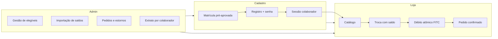
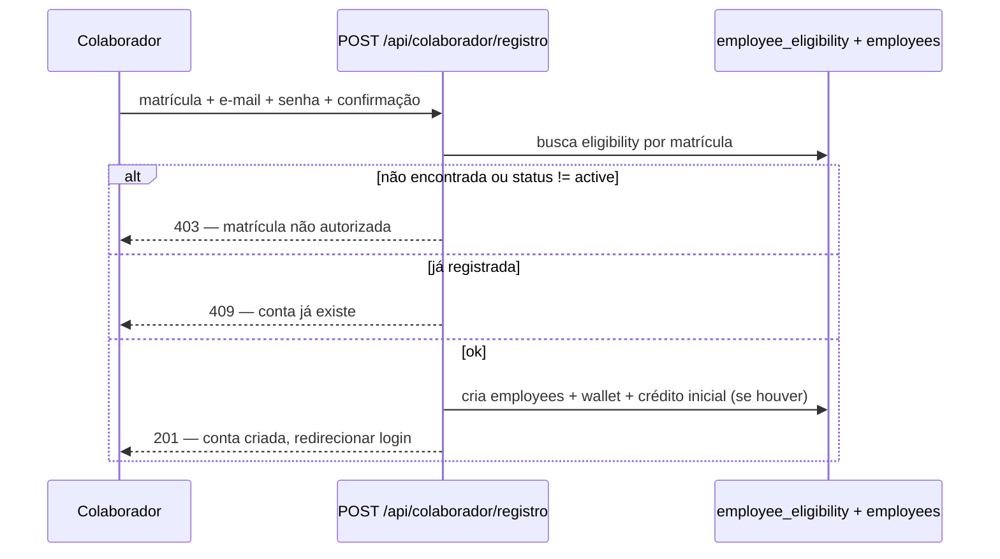
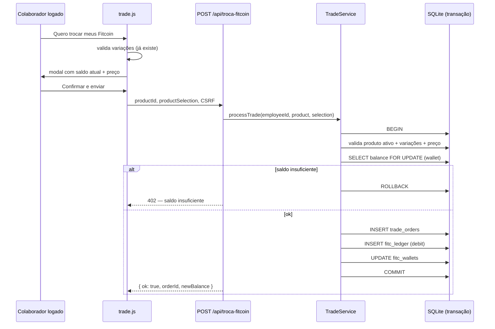

# Plano de implementação — Troca automática de Fitcoin e cadastro de colaboradores

> **Status:** planejamento futuro — não implementado  
> **Projeto:** Movimenta+ / Fit Store  
> **Data:** junho/2026

---

## 1. Contexto e estado atual

### O que existe hoje

| Área | Situação |
|------|----------|
| Loja pública | Catálogo, modal de produto, variações, preço em FITC |
| Troca | Formulário anônimo (nome + e-mail) → `POST /api/troca-fitcoin` |
| Persistência | Tabela `trade_requests` (solicitação, sem vínculo com usuário) |
| Saldo FITC | **Não existe** — texto apenas conceitual na UI |
| Autenticação | Apenas admin (`users.role = 'admin'`) via sessão PHP |
| Admin | Listagem read-only em `/admin/trocas` |

### Limitações do modelo atual

- Qualquer pessoa com nome e e-mail válidos pode solicitar troca.
- Não há verificação de matrícula nem elegibilidade.
- Não há débito de saldo nem histórico de movimentações.
- RH/operacional precisa processar manualmente cada pedido.
- Risco de duplicidade, fraude e inconsistência com o programa Movimenta+.

### Objetivo deste plano

Evoluir para um fluxo em que **colaboradores pré-aprovados** se cadastram na plataforma, visualizam seu **saldo de Fitcoin** e realizam **resgates com débito automático**, com rastreabilidade completa e gestão administrativa.

---

## 2. Visão do produto (estado alvo)



### Princípios de desenho

1. **Matrícula como identidade canônica** — e-mail corporativo pode ser secundário ou derivado.
2. **Saldo como ledger** — nunca atualizar saldo diretamente; sempre registrar movimentações (`credit` / `debit` / `reversal`).
3. **Transação atômica na troca** — validar saldo, criar pedido e debitar em uma única transação SQLite.
4. **Compatibilidade gradual** — manter `trade_requests` evoluída ou migrada; não quebrar o admin existente de imediato.
5. **Reutilizar padrões do projeto** — Slim, Twig, HTMX, CSRF, repositórios, migrations SQLite.

---

## 3. Modelo de dados proposto

### 3.1 Novas tabelas

#### `employee_eligibility` (pré-aprovação / whitelist)

Colaboradores autorizados a se cadastrar, importados pelo RH ou integração Movimenta+.

```sql
CREATE TABLE employee_eligibility (
    id INTEGER PRIMARY KEY AUTOINCREMENT,
    employee_id TEXT NOT NULL UNIQUE,          -- matrícula
    full_name TEXT NOT NULL,
    email TEXT,                                -- opcional na importação
    department TEXT,
    status TEXT NOT NULL DEFAULT 'active',     -- active | suspended | revoked
    initial_balance_fitc INTEGER NOT NULL DEFAULT 0,
    notes TEXT,
    imported_at TEXT NOT NULL DEFAULT (datetime('now')),
    registered_at TEXT,                        -- preenchido no primeiro cadastro
    created_at TEXT NOT NULL DEFAULT (datetime('now')),
    updated_at TEXT
);

CREATE INDEX idx_employee_eligibility_status ON employee_eligibility(status);
```

#### `employees` (conta do colaborador na plataforma)

```sql
CREATE TABLE employees (
    id INTEGER PRIMARY KEY AUTOINCREMENT,
    eligibility_id INTEGER NOT NULL UNIQUE,
    employee_id TEXT NOT NULL UNIQUE,          -- cópia da matrícula para consulta rápida
    email TEXT NOT NULL UNIQUE,
    password_hash TEXT NOT NULL,
    full_name TEXT NOT NULL,
    must_change_password INTEGER NOT NULL DEFAULT 0,
    last_login_at TEXT,
    created_at TEXT NOT NULL DEFAULT (datetime('now')),
    updated_at TEXT,
    FOREIGN KEY (eligibility_id) REFERENCES employee_eligibility(id)
);
```

#### `fitc_wallets` (saldo materializado, opcional mas recomendado)

```sql
CREATE TABLE fitc_wallets (
    employee_id INTEGER PRIMARY KEY,
    balance_fitc INTEGER NOT NULL DEFAULT 0 CHECK (balance_fitc >= 0),
    updated_at TEXT NOT NULL DEFAULT (datetime('now')),
    FOREIGN KEY (employee_id) REFERENCES employees(id)
);
```

> O saldo em `fitc_wallets` deve ser **sempre** derivável da soma do ledger; o campo materializado acelera leitura e exige reconciliação periódica.

#### `fitc_ledger` (livro-razão de movimentações)

```sql
CREATE TABLE fitc_ledger (
    id INTEGER PRIMARY KEY AUTOINCREMENT,
    employee_id INTEGER NOT NULL,
    type TEXT NOT NULL,                        -- credit | debit | reversal
    amount_fitc INTEGER NOT NULL CHECK (amount_fitc > 0),
    balance_after_fitc INTEGER NOT NULL,
    reference_type TEXT,                       -- trade_order | import | manual_adjustment | reversal
    reference_id INTEGER,
    description TEXT,
    created_by_user_id INTEGER,                -- admin, quando aplicável
    created_at TEXT NOT NULL DEFAULT (datetime('now')),
    FOREIGN KEY (employee_id) REFERENCES employees(id),
    FOREIGN KEY (created_by_user_id) REFERENCES users(id)
);

CREATE INDEX idx_fitc_ledger_employee ON fitc_ledger(employee_id, created_at DESC);
```

#### `trade_orders` (pedido confirmado com débito)

Substitui/evolui o conceito de `trade_requests` para pedidos vinculados a colaborador.

```sql
CREATE TABLE trade_orders (
    id INTEGER PRIMARY KEY AUTOINCREMENT,
    employee_id INTEGER NOT NULL,
    product_id INTEGER,
    product_name TEXT NOT NULL,
    product_price_fitc INTEGER NOT NULL,
    product_selection_json TEXT,
    status TEXT NOT NULL DEFAULT 'confirmed',  -- confirmed | cancelled | fulfilled | refunded
    ledger_debit_id INTEGER,                   -- FK fitc_ledger
    fulfillment_notes TEXT,
    created_at TEXT NOT NULL DEFAULT (datetime('now')),
    updated_at TEXT,
    FOREIGN KEY (employee_id) REFERENCES employees(id),
    FOREIGN KEY (product_id) REFERENCES products(id),
    FOREIGN KEY (ledger_debit_id) REFERENCES fitc_ledger(id)
);

CREATE INDEX idx_trade_orders_employee ON trade_orders(employee_id, created_at DESC);
CREATE INDEX idx_trade_orders_status ON trade_orders(status);
```

### 3.2 Alterações em tabelas existentes

#### `users`

Estender `role` para suportar papéis distintos, se necessário no futuro:

- `admin` — gestão completa
- `operator` — (fase 2) apenas pedidos e extratos, sem CRUD de produtos

#### `trade_requests` (legado)

Opções de migração:

| Estratégia | Quando usar |
|------------|-------------|
| **A — Deprecar** | Após go-live; redirecionar endpoint antigo para 410/redirect |
| **B — Evoluir** | Adicionar `employee_id`, `status`, `ledger_debit_id` na mesma tabela |
| **C — Arquivar** | Copiar histórico para `trade_orders` com `employee_id` nulo e flag `legacy` |

**Recomendação:** estratégia **C** na fase de transição; manter leitura no admin unificada.

---

## 4. Cadastro de colaborador (matrícula pré-aprovada)

### 4.1 Fluxo de registro



### 4.2 Regras de negócio

| Regra | Detalhe |
|-------|---------|
| Matrícula obrigatória | Deve existir em `employee_eligibility` com `status = active` |
| E-mail | Validar formato; opcionalmente restringir domínio corporativo (`@redemontagens.com.br`) |
| Senha | Mínimo 8 caracteres; `password_hash` com `PASSWORD_DEFAULT` (igual admin) |
| Nome exibido | Usar `full_name` da elegibilidade; permitir ajuste opcional com auditoria |
| Saldo inicial | Se `initial_balance_fitc > 0` e ainda não creditado, criar entrada `credit` no ledger na ativação |
| Uma conta por matrícula | `UNIQUE(employee_id)` em `employees` e `employee_eligibility` |

### 4.3 Telas e rotas (público)

| Rota | Descrição |
|------|-----------|
| `GET /colaborador/cadastro` | Formulário: matrícula, e-mail, senha, confirmar senha |
| `POST /api/colaborador/registro` | API JSON ou form HTMX |
| `GET /colaborador/login` | Login separado do admin |
| `POST /api/colaborador/login` | Sessão `employee_id` distinta de `user_id` admin |
| `POST /colaborador/logout` | Encerrar sessão |

### 4.4 Middleware de autenticação

Criar `EmployeeAuthMiddleware` análogo a `AuthMiddleware`:

- Sessão: `$_SESSION['employee_id']`, `$_SESSION['employee_matricula']`
- Rotas protegidas: troca, extrato, perfil
- Admin e colaborador em namespaces de sessão separados para evitar conflito

---

## 5. Troca automática com débito de Fitcoin

### 5.1 Novo fluxo (substitui formulário anônimo)



### 5.2 Regras de negócio da troca

1. **Autenticação obrigatória** — endpoint deixa de aceitar `name`/`email` livres.
2. **Recalcular preço no servidor** — reutilizar `ProductVariationValidator` (já existente).
3. **Saldo insuficiente** — HTTP 402 ou 422 com mensagem clara; nenhum pedido parcial.
4. **Produto inativo** — rejeitar mesmo que ainda apareça em cache do cliente.
5. **Idempotência (recomendado)** — header `Idempotency-Key` ou token de confirmação de uma única utilização para evitar duplo clique.
6. **Estoque (fase 2)** — se houver controle de estoque futuro, incluir na mesma transação.

### 5.3 Alterações no frontend

| Arquivo | Mudança |
|---------|---------|
| `resources/js/trade.js` | Exigir sessão; remover campos nome/e-mail; exibir saldo e saldo após troca |
| `templates/layouts/public.twig` | Badge de saldo logado; CTA login/cadastro quando anônimo |
| `templates/public/partials/product.twig` | Botão desabilitado ou "Faça login para trocar" se não autenticado |
| `product-modal-utils.js` | Mesmo comportamento no modal do catálogo |

### 4.4 Alterações no backend

| Componente | Responsabilidade |
|------------|------------------|
| `TradeService` (novo) | Orquestra validação, transação, débito e notificação |
| `TradeController` | Delegar ao service; exigir `EmployeeAuthMiddleware` |
| `FitcWalletRepository` | Leitura de saldo, débito/crédito com lock |
| `FitcLedgerRepository` | Append-only de movimentações |
| `TradeOrderRepository` | CRUD de pedidos confirmados |

### 5.5 Notificações

Manter envio de e-mail opcional (`SMTP_TO`), enriquecido com:

- Matrícula e nome do colaborador
- Saldo anterior e saldo após débito
- ID do pedido (`trade_orders.id`)

Adicionar (fase 2): e-mail de confirmação ao colaborador (`employees.email`).

---

## 6. Gestão administrativa

### 6.1 Novos módulos no admin

| Módulo | Rota sugerida | Funções |
|--------|---------------|---------|
| Elegíveis | `/admin/colaboradores/elegiveis` | Listar, importar CSV, suspender, revogar |
| Colaboradores | `/admin/colaboradores` | Contas registradas, último login, saldo |
| Saldos / extrato | `/admin/colaboradores/{id}/extrato` | Ledger completo, ajuste manual com auditoria |
| Pedidos | `/admin/trocas` (evoluir) | Status, marcar como entregue, estorno |
| Importação FITC | `/admin/fitc/importar` | Crédito em lote por matrícula |

### 6.2 Importação de elegíveis (CSV)

Formato mínimo sugerido:

```csv
matricula,nome,email,departamento,saldo_inicial_fitc
12345,João Silva,joao@empresa.com.br,Operações,120
```

- Validação de duplicatas e matrícula vazia
- Preview antes de confirmar
- Log de importação (`import_batches` — tabela opcional na fase 2)

### 6.3 Estorno / cancelamento

Fluxo administrativo para pedido `confirmed`:

1. Admin marca pedido como `cancelled` ou `refunded`
2. Service cria `fitc_ledger` tipo `reversal` vinculado ao débito original
3. Atualiza `fitc_wallets.balance_fitc`
4. Registra `created_by_user_id` do admin

> Estornos nunca apagam lançamentos — apenas compensam.

### 6.4 Dashboard

Atualizar métricas existentes:

- Total FITC em circulação (soma dos wallets)
- Trocas do período (quantidade e FITC debitados)
- Colaboradores ativos vs elegíveis não registrados
- Pedidos pendentes de fulfillment

---

## 7. Integração com Movimenta+ (opcional, fase 3)

Se o programa Movimenta+ já mantém pontuação FITC em outro sistema:

| Abordagem | Prós | Contras |
|-----------|------|---------|
| **Importação periódica (CSV/API)** | Simples, alinhado ao stack atual | Saldo pode ficar defasado entre syncs |
| **API em tempo real** | Saldo sempre atual | Exige contrato de API, latência, fallback |
| **Movimenta+ como fonte da verdade** | Sem duplicidade de saldo | Fit Store vira proxy; mais complexo |

**Recomendação para MVP:** importação periódica + créditos manuais no admin; evoluir para API quando o contrato estiver estável.

Campos de integração sugeridos em `employee_eligibility`:

- `external_source` (`movimenta`, `manual`, `csv`)
- `external_ref` (ID no sistema origem)
- `last_synced_at`

---

## 8. Segurança e conformidade

| Tema | Medida |
|------|--------|
| Autenticação | Sessão separada admin/colaborador; `session_regenerate_id` no login |
| Brute force | Reutilizar padrão de `AuthController` (lockout 15 min) no login colaborador |
| CSRF | Manter em todos os POSTs |
| Autorização | Colaborador só acessa próprio extrato e pedidos |
| Validação de preço | Sempre server-side via `ProductVariationValidator` |
| Transações | `BEGIN IMMEDIATE` no SQLite para evitar race condition de saldo |
| Auditoria | Ledger imutável; ajustes admin com `created_by_user_id` |
| LGPD | Política de retenção; exportação/exclusão de conta sob demanda do RH |
| PII | Matrícula e e-mail — restringir acesso admin por role na fase 2 |

---

## 9. Fases de implementação

### Fase 0 — Preparação (1 sprint)

- [ ] Aprovar modelo de dados e fluxos com RH/negócio
- [ ] Definir formato de importação de elegíveis e política de saldo inicial
- [ ] Decidir estratégia de migração de `trade_requests`
- [ ] Escrever migrations `004_employee_eligibility.sql`, `005_fitc_ledger.sql`, etc.

### Fase 1 — Cadastro e autenticação (1–2 sprints)

- [ ] Migrations: `employee_eligibility`, `employees`, `fitc_wallets`, `fitc_ledger`
- [ ] `EmployeeEligibilityRepository`, `EmployeeRepository`
- [ ] Telas `/colaborador/cadastro` e `/colaborador/login`
- [ ] `EmployeeAuthMiddleware`
- [ ] Admin: CRUD/importação de elegíveis
- [ ] Testes: registro com matrícula inválida, duplicada, suspensa

### Fase 2 — Saldo e extrato (1 sprint)

- [ ] Exibir saldo no header da loja (colaborador logado)
- [ ] Página `/colaborador/extrato` com paginação
- [ ] Admin: visualizar extrato e crédito manual
- [ ] Job ou comando CLI de reconciliação wallet vs ledger

### Fase 3 — Troca automática (1–2 sprints)

- [ ] `TradeService` com transação atômica
- [ ] Tabela `trade_orders`; migrar/evoluir admin `/admin/trocas`
- [ ] Refatorar `trade.js` e modal (remover nome/e-mail)
- [ ] Bloquear troca para usuário anônimo (CTA login)
- [ ] Idempotência no confirmar
- [ ] E-mail enriquecido pós-troca
- [ ] Testes E2E: saldo suficiente, insuficiente, produto inativo, duplo submit

### Fase 4 — Operação e integração (1+ sprint)

- [ ] Status de pedido: `fulfilled`, notas de entrega
- [ ] Estorno administrativo
- [ ] Importação em lote de créditos FITC
- [ ] Integração Movimenta+ (se aplicável)
- [ ] Deprecar endpoint legado sem autenticação

### Fase 5 — Hardening

- [ ] Monitoramento de divergência wallet/ledger
- [ ] Rate limit no endpoint de troca
- [ ] Documentação operacional para RH
- [ ] Backup e restore testado com novas tabelas

---

## 10. Impacto em arquivos existentes (referência)

| Arquivo / área | Ação prevista |
|----------------|---------------|
| `database/schema.sql` | Documentar novas tabelas após migrations |
| `src/Controllers/TradeController.php` | Delegar a `TradeService`; exigir employee auth |
| `resources/js/trade.js` | Novo fluxo autenticado |
| `templates/layouts/public.twig` | Saldo, login colaborador, modal simplificado |
| `templates/admin/trades/index.twig` | Colunas: matrícula, status, saldo pós-troca |
| `routes/web.php` | Rotas colaborador + middleware |
| `routes/admin.php` | Módulos elegíveis, extrato, importação |
| `README.md` | Atualizar após implementação |

---

## 11. Critérios de aceite (MVP)

1. Colaborador com matrícula em `employee_eligibility` consegue criar conta e fazer login.
2. Colaborador sem matrícula pré-aprovada **não** consegue se cadastrar.
3. Saldo FITC é exibido na loja após login.
4. Troca bem-sucedida debita o valor exato (com variações) e cria pedido em `trade_orders`.
5. Troca com saldo insuficiente falha sem criar pedido nem lançamento.
6. Admin visualiza pedidos com matrícula e pode consultar extrato do colaborador.
7. Histórico em `trade_requests` legado permanece acessível ou migrado.
8. Nenhum débito ocorre fora de transação atômica.

---

## 12. Riscos e mitigações

| Risco | Mitigação |
|-------|-----------|
| Saldo desatualizado vs Movimenta+ | Sync periódico + data da última atualização na UI |
| Concorrência (dois resgates simultâneos) | `BEGIN IMMEDIATE` + validação de saldo na transação |
| Colaborador desligado ainda resgatando | Campo `status` em elegibilidade; job de suspensão |
| Regressão no fluxo anônimo atual | Feature flag `REQUIRE_EMPLOYEE_AUTH_FOR_TRADE` durante transição |
| Complexidade de sessão dupla (admin + colaborador) | Namespaces de sessão distintos; nunca misturar middlewares |

---

## 13. Decisões em aberto (para alinhamento com negócio)

1. Matrícula é numérica fixa ou aceita prefixos/alfanumérico?
2. E-mail no cadastro deve ser obrigatoriamente corporativo?
3. Saldo inicial vem só na importação ou também por integração contínua?
4. Pedido confirmado exige aprovação do RH antes do débito, ou débito é imediato?
5. Há limite de resgates por período (ex.: 1 por semana)?
6. Produtos com estoque finito entram no MVP ou ficam para fase 2?
7. Colaborador pode cancelar pedido antes do fulfillment?

---

## 14. Referências no código atual

- Troca (solicitação): `src/Controllers/TradeController.php`
- Frontend da troca: `resources/js/trade.js`
- Validação de variações: `src/Support/ProductVariationValidator.php`
- Listagem admin: `src/Controllers/Admin/TradeRequestController.php`
- Schema: `database/schema.sql`, migration `002_trade_selection_json.sql`
- Auth admin (padrão a replicar): `src/Controllers/Admin/AuthController.php`, `src/Middleware/AuthMiddleware.php`

---

*Documento gerado para planejamento. Nenhuma alteração de código foi feita.*
